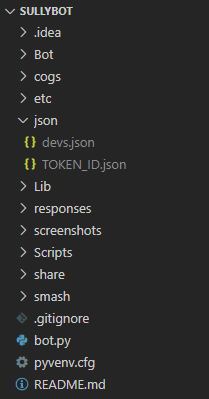

# SullyBot

_A Discord bot by and for people who are kinda good at a few things_

# Usage and Setup

## Quick Tips

Currently, all SullyBot commands are used by typing in the Discord chat. Each SullyBot command uses the format `*{command}`.

## Setup Notes

If setting this bot up for personal use, you will need to add a `json` folder to the root of the bot's directory. Currently, this folder holds two files you will need: `json/TOKEN_ID.json` and `json/devs.json`.

Your bot directory should look like this:



The `TOKEN_ID.json` file is what will hold your Discord bot Token to connect to Discord's API. The contents should look as follows:

```json
{
    "TOKEN": "your Discord token here"
}
```

The `devs.json` file contains all of the Discord user ID's that are on your bot's dev list. These users have the ability to shut the bot down from the Discord chat, among other features in the future. Before you can add users to the dev list using the `dev` command in Discord, you will need to add at least 1 user ID to this list. The contents should look as follows:

```json
{
    "devs": [000000000000000000, 000000000000000000]
}
```

> In `devs.json`, these user ID's should be 18 digit integers as shown above. Although you only need to start with one ID, two are shown here to demonstrate how they should be formatted as an integer and delimited with a comma.

You can find your user ID by first enabling Developer Mode in Discord(Settings > App Settings > Advanced > Enable Developer Mode), then right-clicking your profile and choosing "Copy ID".

# Commands

Here's a list of all of SullyBot's currently supported commands and how to use them.

## Standard Functions

### `!ping`

Checks the user's Discord ping, responds based on whether its is above or below 1000ms.

### `!pong`

Pings the bot to ensure that it is up and running correctly. Responds with `"Ping!!!!!!!!!"`.

### `!advise (question)`

Magic 8-Ball style. Responds to a given `question` with an answer.

### `!hello`

Says hi to the bot, to which it will return the courtesy!

Aliases: `!hi`

### `!join`

Tells the bot to join the author's current voice channel.

### `!leave`

Tells the bot to leave the current voice channel.

### `!dev (condition, person)`

Used to `add` or `remove` (`condition`) a mentioned Discord user (`person`) from the bot's dev list.

Perms: Message author must already be a dev listed in the `devs.json` file.

### `!close`

Used to shut off the bot directly from Discord chat.

Aliases: `!quit`, `!q`, `!kill`, `!kil`, `!die`  
Perms: Message author must be on the dev list.

## Smash Functions

### `!smash (condition, arg)`

View or edit the current Smash roster. The `smash` command must be used to set up the roster before the `fight` command can be used.

Below is a table to help with using the parameters for this command:

| `Condition`       | `Arg`                  | Notes                                                             |
| ----------------- | ---------------------- | ----------------------------------------------------------------- |
| `roster`          | None                   | Prints the current smash roster                                   |
| `clear`           | None                   | Clears the current smash roster                                    |
| `add`             | Mentioned Discord User | Adds the mentioned Discord user to the roster                     |
| `remove` / `drop` | Mentioned Discord User | Removes the mentioned Discord user from the roster                |
| `players`         | None                   | Prints the number of players that play per singles match          |
| `players`         | `2`, `3`, or `4`       | Sets the number of players per singles match to the given integer |

### `!fight (fight_type)`

Begins a series of smash from the current smash roster. SullyBot supports 2v2 team games, as well as singles/free-for-all matches. This command will mention all of the players playing in the first round of the game.

Do not use this command between rounds using the same roster, as you should use `next_fight` to generate the players for the next round. However, if you make any changes to the roster or players per singles game using the `smash` command, or if you want to switch between singles-type and doubles-type games, you will need to use `fight` for those changes to take effect.

Below is a table to help with using the parameters for this command:

| `Fight_Type` | Roster Size Allowed | Notes                                                                                                       |
| ------------ | ------------------- | ----------------------------------------------------------------------------------------------------------- |
| `singles`    | `3` to `8`          | Every player fights on their own; Default of `2` players per game if not specified with the `smash` command |
| `doubles`    | `4` to `8`          | Players team up with another player to fight a different team of two                                        |

### `!next_fight`

Generates a set of players to play in the next round of smash, and mentions those players in the Discord chat. This command works the same, no matter if you're playing singles or doubles.

Do not use this command if you haven't generated a game yet using the `fight` command, or if you haven't started a roster yet using the `smash` command.

## Music Functions

These commands will be used for the music bot functionality of SullyBot.

Below is a table to help with using the parameters for this command:

| `Condition`       | `Arg`                  | Notes                                                                 |
| ----------------- | ---------------------- | -----------------------------------------------------------------     |
| `play`            | Song URL               | Will play the song or add it to a queue if a song is playing already  |
| `queue`           | None                   | This will display up to the next 10 songs in a queue                  |
| `pause`           | None                   | Pauses the currently playing song                                     |
| `resume`          | None                   | Resumes the currently playing song                                    |
| `skip`            | None                   | This will skip the currently playing song and continue to the next    |
| `clear`           | None                   | Clears the song queue                                                 |
| `shuffle_queue`   | None                   | This will shuffle the songs that are in the queue                     |
